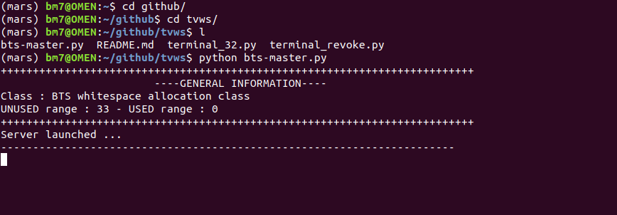
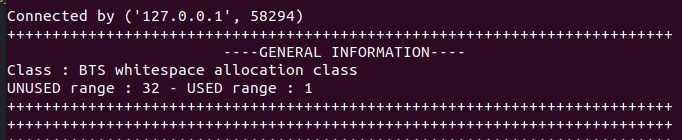
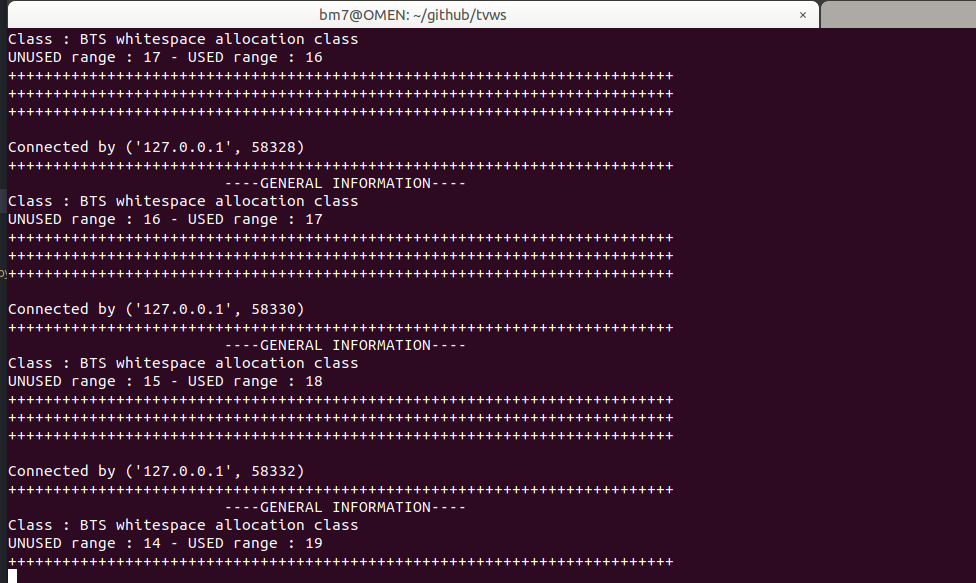
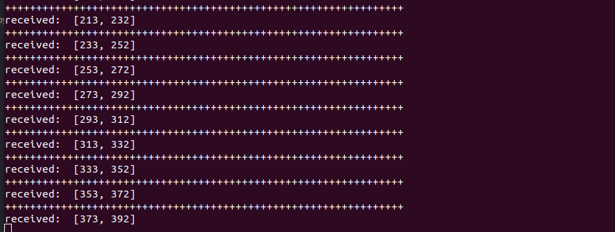
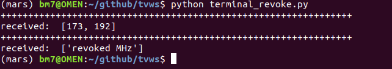

### TVWS implementation in pyhton

This code has 3 part.

## 1. BTS
#### Launch BTS as server
```
python3 bts-master.py
```


#### ** print Terminal 1 request **


#### ** print Terminal 32 request **



## 2. Terminal
#### Launch terminal 32 as client
```
python3 terminal-32.py
```


#### ** print terminal revoked (sent 1 and revoked 1) request **



